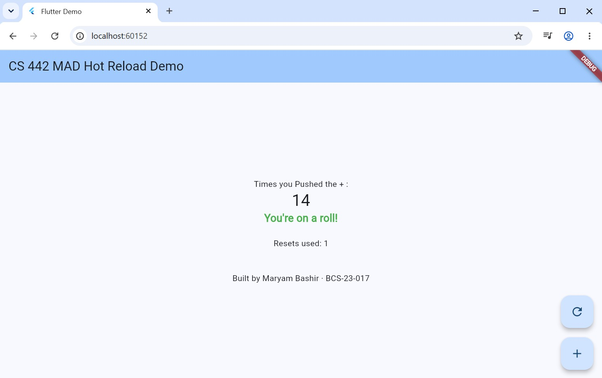

# CS 442 Lab 1: Enhanced Counter App

**Name:** Maryam Bashir  
**Roll Number:** BCS-23-017  

## App Screenshot

## Reflection
`setState(() {...})` tells the Flutter framework that the internal state of a `StatefulWidget` has changed. When called, it triggers the widget's `build` method to run again, redrawing the UI to reflect the updated variables. Without `setState`, the variable updates in the background, but the screen stays frozen on the old data because Flutter wouldn't know it needs to re-render the changes.